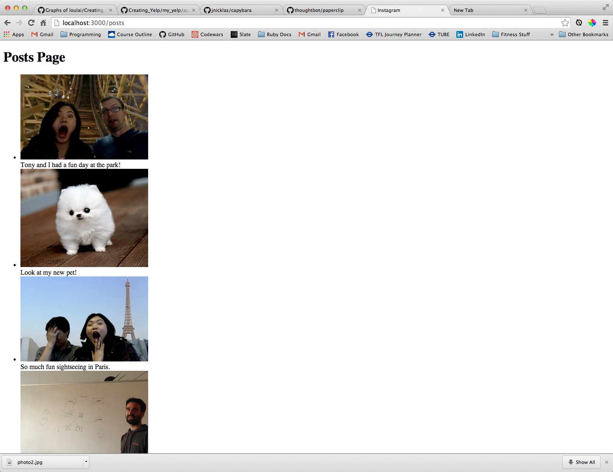
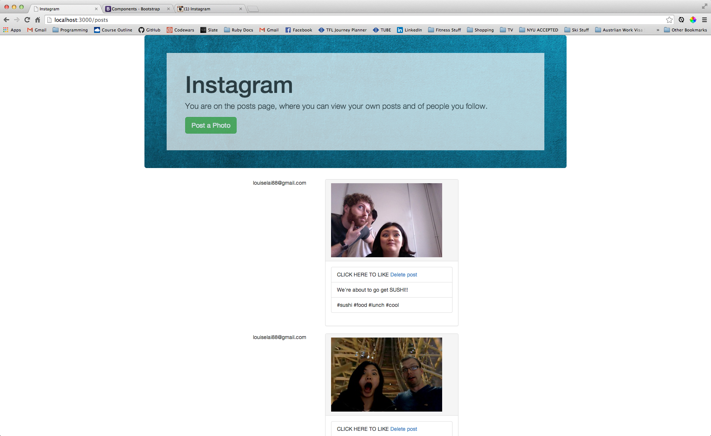
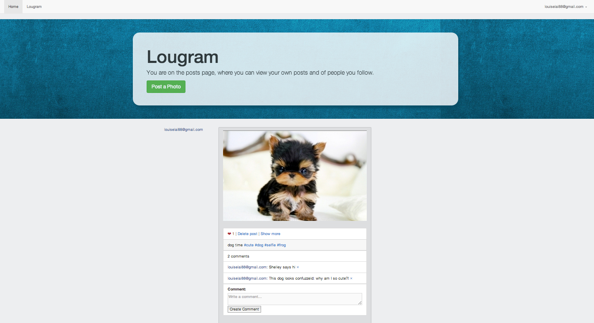

Lougram
===
Lougram is a two week project that replicates the basic functionality of Instagram. The primary goal of this project is not to clone Instagram with exact precision, but rather to emerge with a greater command of Rails, Ruby, Databases and a handful of select technologies. 

This is my third project using Rails. 

Testing
---
This project is test driven. Integration testing is done with Cucumber and unit testing is done with Rspec.

Heroku
---
This application is deployed on Heroku. Click [here] to play with the better Instagram (I joke, I joke).

Timeline
---

This is what my Lougram looked like before Bootstrap:

After a little Bootstrap magic (panels, panel lists, jumbotron, columns, column offsets etc.):

More Bootstrap (expanded jumbotron, background color, navbar, photo centering, font coloring) and features (likes, comments, deleting comments, hashtags, modals and more).

Features
---
Ideally, Lougram will have all the features of the real Instagram. However, time and my current ability are limitations that filter what I can do from what I want to do.

So I drew up these tables to keep track of current features versus wish-list features. As I spend more time on this project and get more proficient at Rails, I will be updating this section so it's concurrent with my application.

Feature        | Current Features                             | Wish-list Features
:-------------:| :-------------------------------------------:|:--------------------------------------------:
Signing in     | Must sign in with email                      | Signing in with a required & unique username
               | Must sign in with password                   |
Comments       | Anyone can comment on a photo                | Nicer looking input section
               | Adequate looking input section               | Instant update (websockets)
               | Can be deleted                               |
Hashtags       | Displays photos by hashtags                  | 
               | 'Show' page has changing header              | 
Likes          | Any user can like a photo                    | A user can like a photo only once
               | Updates when clicked without page refresh    | A user can unlike a photo
               |                                              | 'Like' button darkens upon liking

Technologies Used
---
* Cucumber
* Rspec
* Ruby
* Rails
* Devise
* Paperclip
* Bootstrap
* Websockets
* Heroku

[here]:http://lougram.herokuapp.com/
