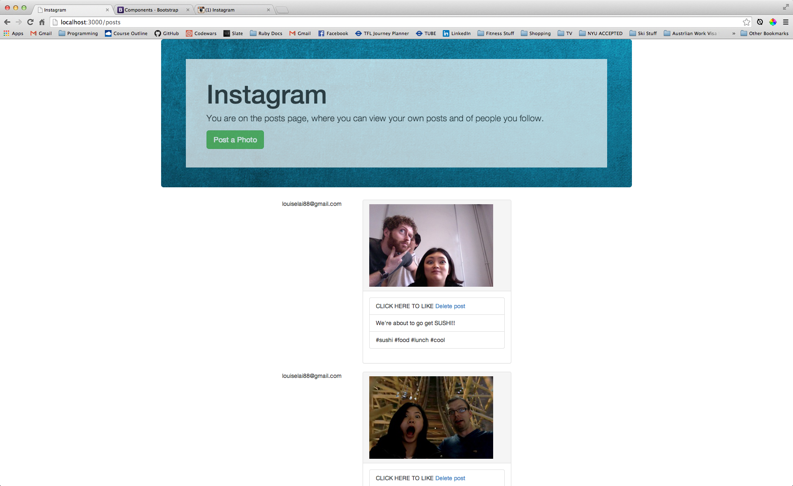

== README

This README would normally document whatever steps are necessary to get the
application up and running.

Things you may want to cover:

* Ruby version

* System dependencies

* Configuration

* Database creation

* Database initialization

* How to run the test suite

* Services (job queues, cache servers, search engines, etc.)

* Deployment instructions

* ...

Please feel free to use a different markup language if you do not plan to run
<tt>rake doc:app</tt>.

Instagram
===
This is a two week project that re-creates Instagram using Rails. The end goal is to learn how to build websites from scratch and understand databases and Rails better. 

This is my third project using Rails. 

Testing
---
This project is 100% TDD. Integration testing is done with Cucumber and unit testing is done with Rspec.

Timeline
---
This is what my Instagram looked like before Bootstrap:

After a little Bootstrap magic (panels, panel lists, jumbrotron, columns, column offsets etc.):

Features
---
Ideally, my version of Instagram will have all the features of the real Instagram. However, time and my current ability are limitations that filter what I *can* do from what I *want* to do.

So I drew up this table that contains what I wish my Instagram has versus what I actually have. As I spend more time on this project and get more proficient at Rails, more features are added.

Current Features | Feature Wish-List
:----------------: | :-------------------:
Signing in | Signing in with a required username
Comments| Likes
Hashtags | Display photos by hashtags

Tech
---
* Cucumber
* Rspec
* Ruby
* Ruby on Rails
* Paperclip
* Bootstrap

