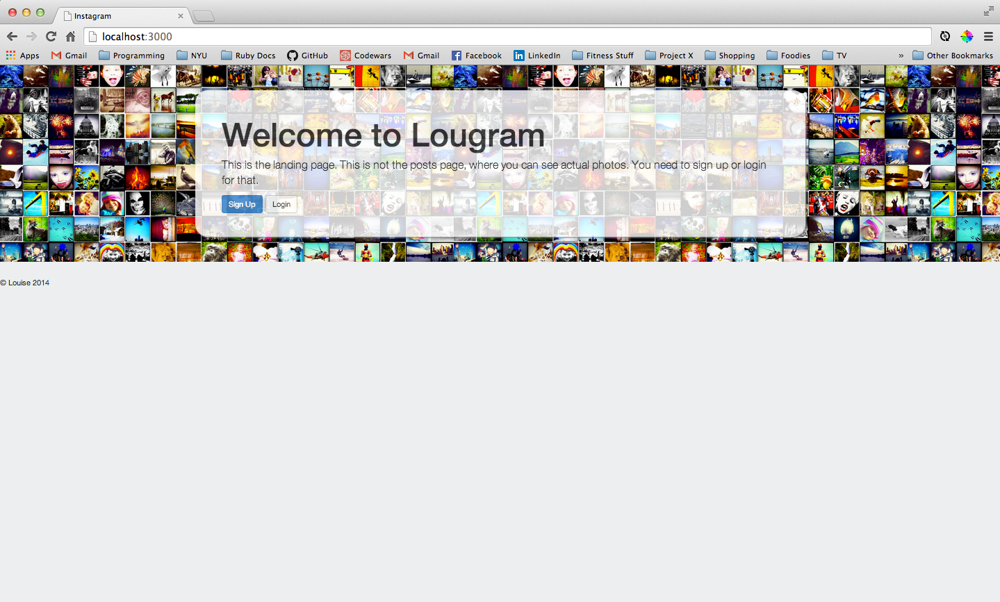

Lougram
===
Lougram is a two-week project that replicates the basic functionality of Instagram. The primary goal of this project is not to clone Instagram with exact precision, but rather to emerge with a greater command of Rails, Ruby, Databases and a handful of new technologies. 

This is my third project using Rails. 

Testing
---
This project is test driven. Integration testing is done with Cucumber and unit testing is done with Rspec.

Heroku
---
This application is deployed on Heroku. Click [here] to play with the better Instagram (I joke, I joke).

Timeline
---

This is what Lougram looked like before Bootstrap:


After a little Bootstrap magic (panels, panel lists, jumbotron, columns, column offsets etc.):


More Bootstrap (expanded jumbotron, background color, navbar, photo centering, font coloring) and features (likes, comments, deleting comments, hashtags, modals and more).


Features
---
Ideally, Lougram will have all the features of the real Instagram. However, time and my current ability are limitations that filter what I can do from what I want to do.

So I drew up these tables to keep track of current features versus wish-list features. As I spend more time on this project and get more proficient at Rails, I will be updating this section so it's concurrent with my application.

Feature         | Current Features                       | Wish-list Features
---------------:| :------------------------------------- |:-------------------------------------
**Signing in**  | Must sign in with email                | Mandatory username when signing up
                | Must sign in with password             | Username must be unique
**Comments**    | Anyone can comment on a photo          | Nicer looking input section
                | Adequate looking input section         | Instant update (websockets)
                | Can be deleted                         | -
**Hashtags**    | Displays photos by hashtags            | -
                | 'Show' page has changing header        | -
**Likes**       | Any user can like a photo              | A user can like a photo only once
                | Instant updates (websockets)           | A user can unlike a photo
                | -                                      | 'Like' heart darkens upon liking

Lougram in Development Mode
===
Lougram can be run in your localhost if you wish to play around with the code. You can do so easily by following these steps.

First you'll need to clone this repo by typing this snippet into your terminal:
```
$ git clone git@github.com:loulai/Creating_Instagram.git
```

Then change into the newly cloned directory:
```
$ cd Creating_Instagram
```

Acquire the necessary gems to run Lougram:
```
$ bundle install
```

Update your database by running the migration:
```
$ bin/rake db:migrate
```

Run the application on your localhost (which defaults to port 3000):
```
$ bin/rails server
```

Finally, open up your web broswer, and in the URL field type: ``localhost:3000``

Now your browser should look something like this:

Because you need to create an account to access the photo homepage, you'll be prompted to either sign up or login. Happy Lougramming!


Technologies Used
---
* Cucumber
* Rspec
* Ruby
* Rails
* Devise
* Paperclip
* Bootstrap
* Websockets
* Heroku


[here]:http://lougram.herokuapp.com/
